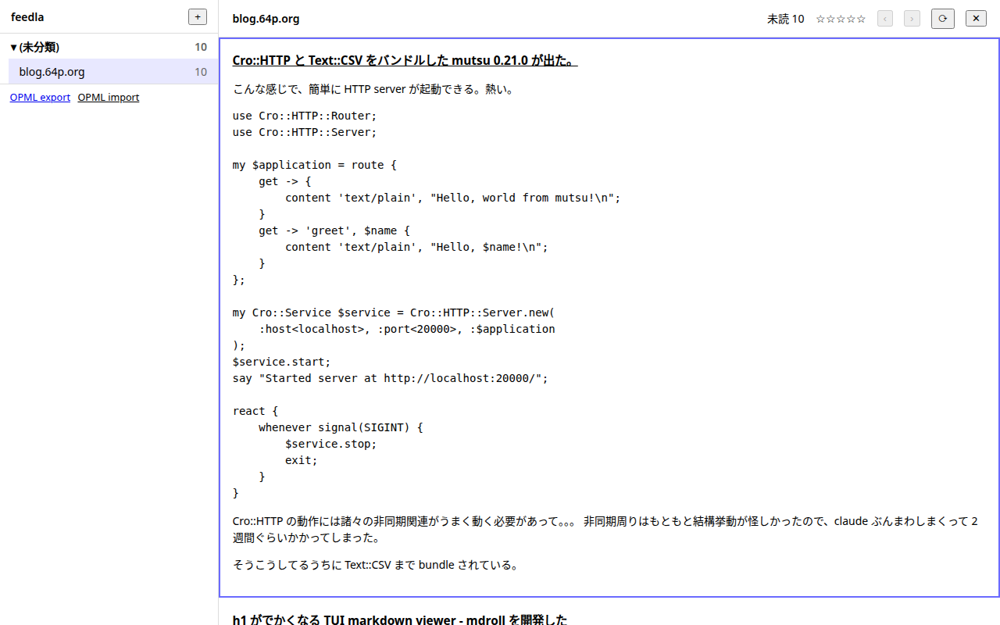
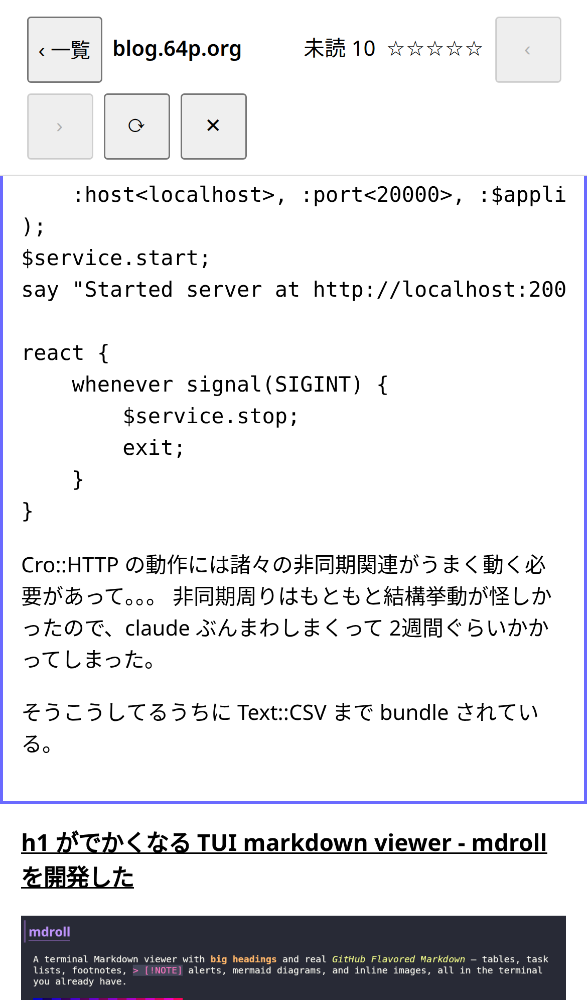
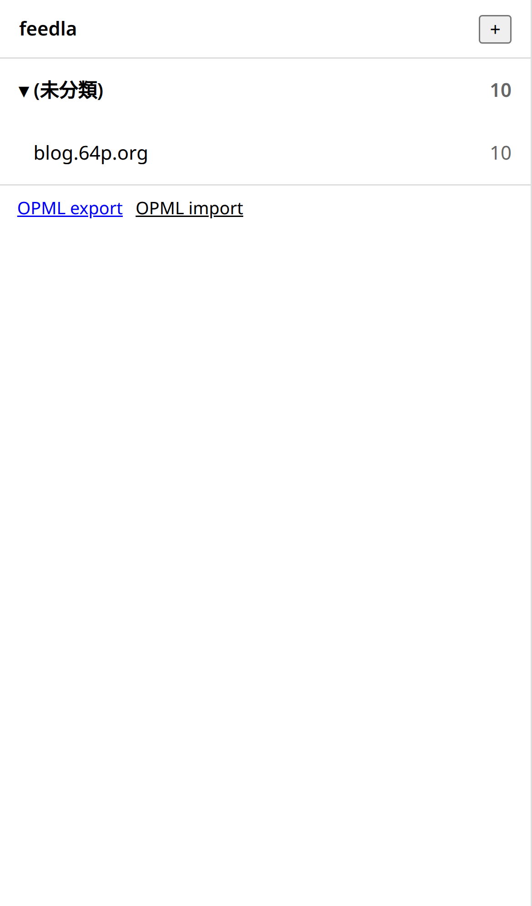

# feedla

livedoor Reader / Fastladder のような「大量のフィードを高速に読み流す」体験を
再現した、自分専用のセルフホスト型 RSS/Atom リーダーです。単一バイナリ + SQLite
だけで動き、外部 DB やジョブキューは不要です。

## スクリーンショット

| デスクトップ(3 ペイン) | モバイル: 記事ペイン | モバイル: 購読一覧 |
|---|---|---|
|  |  |  |

## 特徴

- **シングルバイナリ + SQLite 1 ファイル**。外部ミドルウェアなしで動く。
- **軽量**。数百〜千フィード規模を RAM 100MB 以下・常時 CPU ほぼゼロで運用できる。
- **LDR 風の 3 ペイン UI**。キーボードだけで大量の記事を読み流せる。
- **スマホ対応**。狭幅では 1 画面ずつの表示に切り替わり、スクロールで既読になる。
  左右スワイプで次 / 前の記事へ移動でき、長い記事を最後までスクロールせずに読み飛ばせる。
- **フィード取得は並列・適応間隔**。更新頻度に応じて巡回間隔を自動調整し、
  取得元サーバへの負荷にも配慮する（条件付き GET、ホストごとの同時接続制限など）。
- OPML のインポート / エクスポート、全文検索、あとで読む(pin)、フォルダ分けに対応。
- Docker イメージは非 root・`FROM scratch` ベースで実測 約13MB。

利用者は自分専用（シングルユーザー）を前提とした設計です。内部設計・アーキテクチャの
詳細は [docs/DESIGN.md](docs/DESIGN.md) を参照してください。

## クイックスタート（Docker）

```sh
docker run -d \
  --name feedla \
  -p 8080:8080 \
  -v feedla-data:/data \
  ghcr.io/tokuhirom/feedla:latest
```

起動後、ブラウザで `http://localhost:8080` を開きます。データは `/data`
（コンテナ内）に永続化されるので、上記のように named volume を割り当ててください。

初回起動時、`feeds` テーブルが空であればデフォルトの購読リストが自動投入されます。

## ソースからのビルド

Go 1.26+ / Node.js（`pnpm`）が必要です。

```sh
make build   # フロントエンドのビルド → Go バイナリのビルド
./feedla serve
```

開発時にフロントエンドを触る場合は `make web-dev`（Vite dev server）を使います。

## 設定（環境変数）

| 変数 | デフォルト | 説明 |
|---|---|---|
| `FR_LISTEN` | `127.0.0.1:8080`（Docker イメージでは `0.0.0.0:8080`） | 待受アドレス。外部公開する場合は明示的に指定する。 |
| `FR_DB_PATH` | `/var/lib/feedla/feedla.db`（Docker イメージでは `/data/feedla.db`） | SQLite ファイルのパス。 |
| `FR_FETCH_CONCURRENCY` | `32` | フィード取得の全体同時実行数。 |
| `FR_FETCH_MIN_INTERVAL` | `10m` | 巡回間隔の下限。 |
| `FR_FETCH_MAX_INTERVAL` | `12h` | 巡回間隔の上限。 |
| `FR_RETENTION_DAYS` | `30` | 既読記事を保持する日数。 |
| `FR_RETENTION_PER_FEED` | `1000` | フィードごとの記事保持件数上限。 |
| `FR_BACKUP_DIR` | `/var/backups/feedla` | 日次バックアップ（`VACUUM INTO`）の出力先。 |
| `FR_USER_AGENT` | `feedla/0.1 (+https://example.com/bot)` | フィード取得時の User-Agent。 |
| `FR_LOG_LEVEL` | `info` | ログレベル。 |

シングルユーザー向けの認証機能は現状ありません。外部公開する場合は
リバースプロキシ側で認証をかけるか、`FR_LISTEN` を信頼できるネットワークに限定
してください。

## キーボードショートカット

| キー | 動作 |
|---|---|
| `j` / `k` | 次 / 前の記事へスクロール（記事単位でスナップ） |
| `space` / `shift+space` | ページ単位スクロール |
| `s` / `a` | 次 / 前の購読へ |
| `v` | 記事を新規タブで開く |
| `p` | pin する |
| `o` | pin 一覧を開く |
| `r` | 未読を再取得(サーバへ再クロールを指示) |
| `/` | 検索 |
| `?` | ヘルプ |

## バックアップ

日次で `VACUUM INTO '<FR_BACKUP_DIR>/feedla-YYYYMMDD.db'` を実行し、WAL 中でも
安全にバックアップを取得します。OPML エクスポート（`GET /api/v1/opml`）も
定期的に取得しておくと、最悪 DB を失っても購読リストから復元できます。

## 開発に参加する

開発運用（ブランチ運用・pre-commit・ツールチェーン管理など）は
[CLAUDE.md](CLAUDE.md) を、内部設計・アーキテクチャ・API 仕様・テスト方針などは
[docs/DESIGN.md](docs/DESIGN.md) を参照してください。
